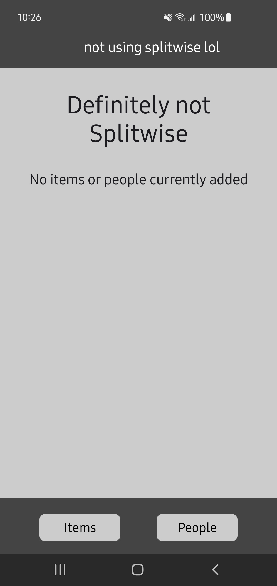
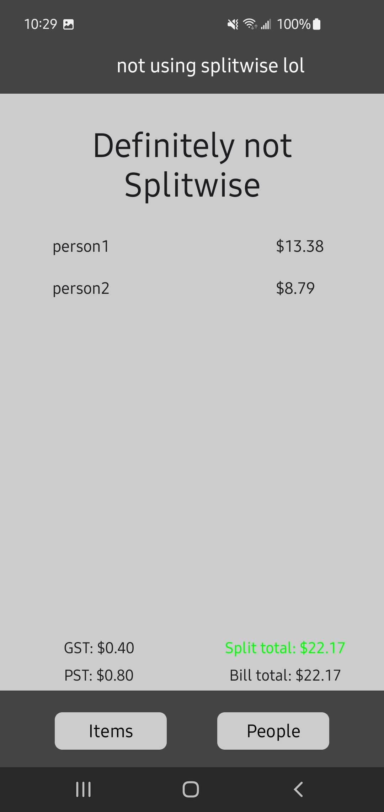
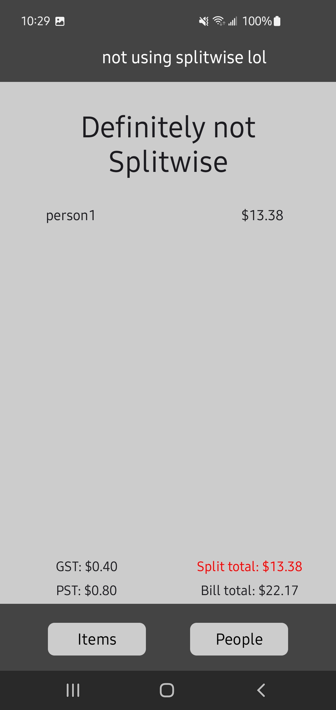
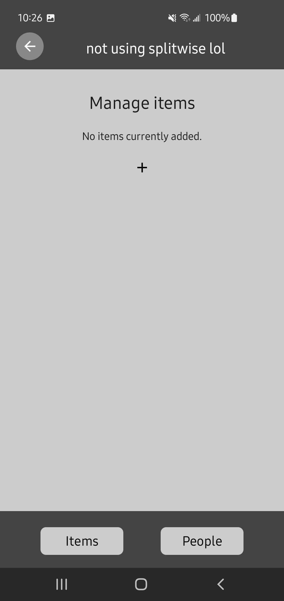
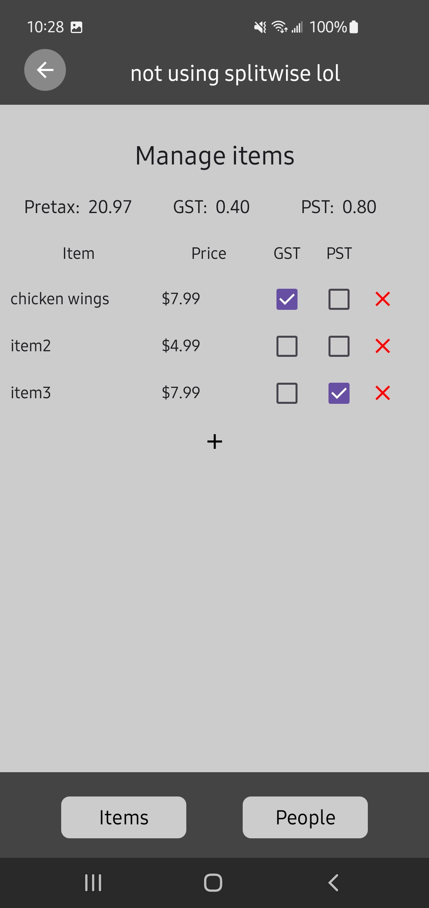
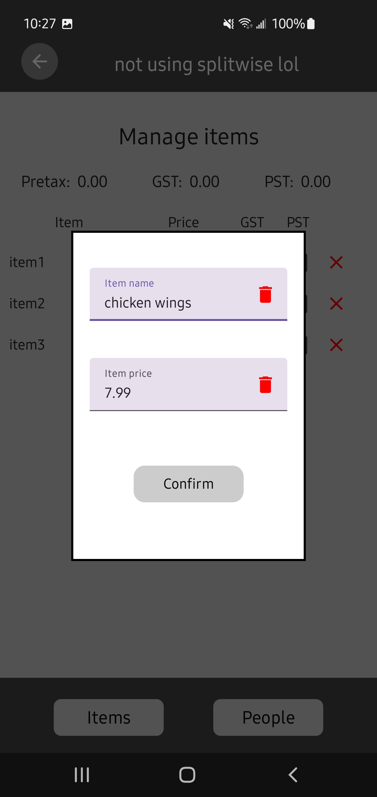
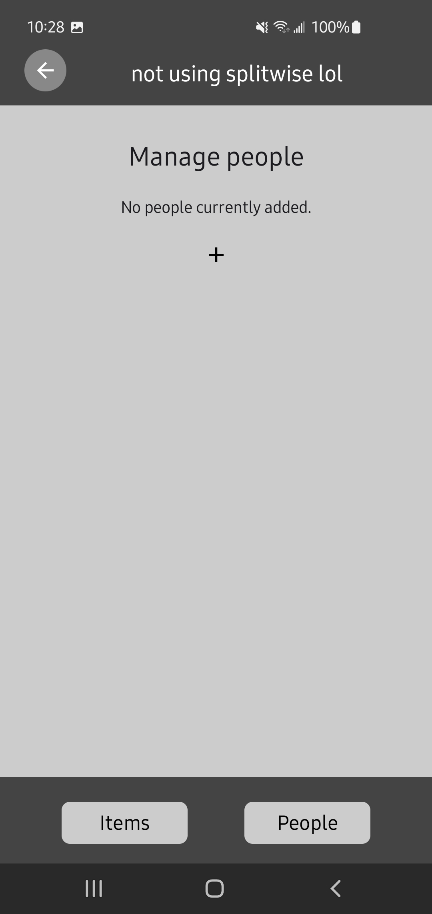
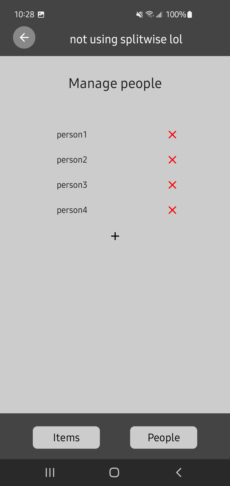
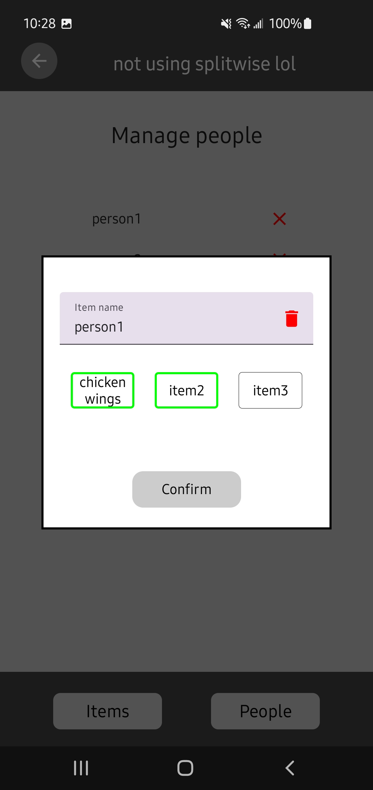

# My own cost splitter

I didn't want to download Splitwise so I made my own basic version to split costs with friends.

Every feature and screen was designed to be lightweight so that I can quickly calculate how much each friend owes to the person who fronted the bill.
Everything was made to be easy to understand so if my friends want to use the app, they can understand how to use it without asking for help.
UI wasn't a focus; I didn't make this to be pretty, just something easy on the eyes and functional.

## Features
* add items and change their name, price, tax inclusion (GST and/or PST)
* add people and allow changing their name and assigning items to them
* can see at a glance if every item has been assigned and the bill totals and costs for each person

# Preview

## Home screen
    

* shows a message if items and/or people not yet added
* highlights the split total in red if an item hasn't been assigned to any person yet
* highlights the split total in green if all items have been assigned to at least one person
* shows the tax amounts and total amount of the bill to compare with the actual bill

## Items
    

* show/manage the items added to the list
* items can be clicked to open a popup to change its name and price
* gst and pst can be toggled by clicking the checkbox
* bill subtotal and gst totals shown at top for quick bill comparison
* names don't need to be changed if user wants to be quicker with getting the final calculations

## People
    

* show/manage the people included in the split
* people can be clicked on to open a popup to change their name and assign items to them
* assigned items highlighted green to easy

# Extra nice things / To-dos
* A better name and title for the app
* Better highlighting/outlining of boxes/components in all screens
* Instant popup on adding a new item/person to allow earlier input of price or item assignment
* Get someone to do the UI design for me so I can just implement it
