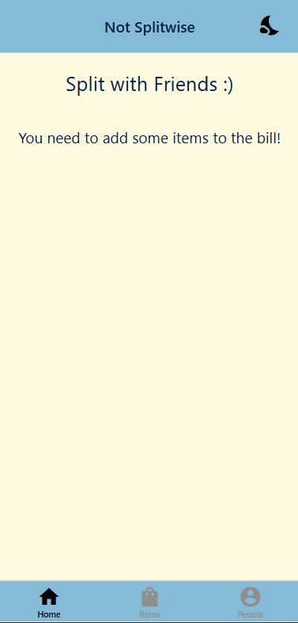

# Split with Friends :)

I didn't want to download Splitwise so I made my own basic version to split costs with friends.

Most of the app was designed to be lightweight so that I can quickly calculate how much each friend owes to the person who fronted the bill.
Everything was made to be easy to understand so if my friends want to use the app, they can understand how to use it without asking for help.
UI wasn't a focus; I didn't make this to be pretty, just something easy on the eyes and functional.

## Features
* add items and change their name, price, tax inclusion (GST and/or PST)
* add people and allow changing their name and assigning items to them
* quickly share the costs with friends, utilizing the device's share function

# Preview

## Home screen
    

* shows a message if items and/or people not yet added
* shows all subtotals and total to compare with actual bill
* tip popup used to change the tip, whether by percentage or by flat amount
* share button allows sending a text string as a message using phone's sharing capabilities
* icon on top right allows changing between light and dark mode

## Items
    

* show/manage the items added to the list
* items can be clicked to open a popup to change its name and price
* item price and taxes handled in the popup
* bill subtotal and gst totals shown at top for quick bill comparison

## People
    

* show/manage the people included in the split
* people can be clicked on to open a popup to change their name and assign items to them

## Version
Current: 2.0

2.0
- Ported over the project to React Native, properly utilizing classes and state/content management for easier development/testing
- Added sharing function to allow sending the bill/breakdown to people
- Added colour theming

1.0
- Kotlin version with very basic and boring UI